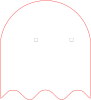
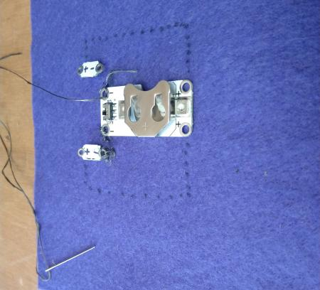
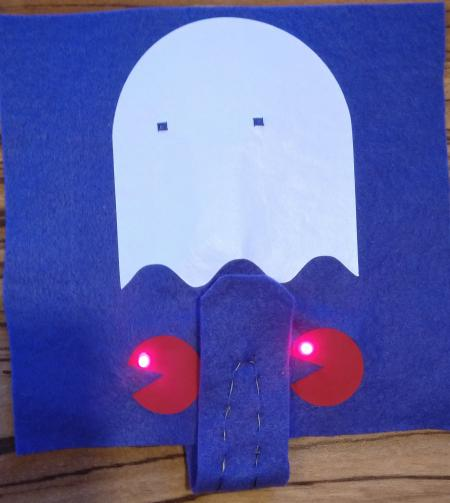

We develop smart textiles over several levels.

# Level 1: Textile Light Circuit

## Introduction

In this level, we create a LED light circuit for application on textiles. This could be used for:

1. Adapt a fluo safety jacket to make it more save
2. Pimp a cap for the sports team you supporter for 
3. Make a halloween costume

What makes this circuit different from a normal light circuit is that we use textile elements or electronical components 
adapted for use on textiles.

## BOM (Bill of Materials)

1. Base textile: a T-shirt, a baseball cap, a fabric. Select the textile you want to add lights to!
    1. Fruit of the Loom t-shirts can be bought for less than 2 Eur/T-shirt. Google it!
    2. Baseball caps can be bought for 1 to 2 Eur. 
    3. Cotton bags can be bought for less than 2 Eur, eg [De Banier](https://www.debanier.be/katoenen-zak-38-x-42-cm-met-lang-schouderlint-ecru.html)
2. Design: Your final product will be nicer if there is a design on your base textile. You can use other fabrics to make
a design, or use transfer vinyl paper, or transfer paper, or embroidery. Make sure in your design it is clear where the LED-Lights
go. A single small coincell battery can power maximally 3 LED1
3. Conductive thread. You need a high conductive (low resistance) conductive yarn. Some options:
    1. Stainless steel. The cheapest option. Many resellers of [adafruit Stainless Thin Conductive Thread](https://www.adafruit.com/product/640), for example [Mouser](https://www.mouser.be/ProductDetail/Adafruit/603?qs=sGAEpiMZZMu%252BmKbOcEVhFQfi8wYXkauJFoZL2xpCq%252BVRONBlSbRF3w%3D%3D)
    2. Silver plated yarn. The highest conductivity. Madeira has a range for embroidery that can be bought from every Madeira reseller: [HC 12 150m SMALL CONE](https://shop.madeira.co.uk/hc-12-150m-sample-(high-conductive)_hc12-smp-xxx-xxx.htm)
4. LED lights. You can use standard ones (cheapest) or specially designed (brighter)
    1. Sewable LED lights with integrated resistor, eg from [Kitronik](https://www.kitronik.co.uk/2746-electro-fashion-sewable-5mm-led-holder-pack-of-10.html)
    2. Standard 3V LED packs, eg from [amazon.de](https://www.amazon.de/APTWONZ-2-poligen-Diffuse-Leuchtdioden-Elektronikkomponenten/dp/B06X3VT6TD)
    3. In combination with above standard LED, you can 3D print a small holder making it more easy to attach the LED to textile. Use [this design](https://www.thingiverse.com/thing:265121) then
5. Battery holder for coincell battery. We use a 3.3V coincell. You can buy a normal coincell holder, one specifically designed for textile, or 3D print one.
    1. Sewable battery holder with switch, eg from [Kitronik](https://www.kitronik.co.uk/2711-electro-fashion-switched-coin-cell-holder.html)
    2. Sewable battery holder without switch, eg from [Kitronik](https://www.kitronik.co.uk/2701-sewable-coin-cell-holder.html)
    3. 3V battery holder standard with holes that allow sewing, eg [BA2032SM](https://www.enrgtech.co.uk/buy/product/ET14129119/BA2032SM)
    4. CR2032 battery. This is the standard coincell battery you can buy everywhere for 1 to 2 Eur.
    5. 3D print 3V battery holder, eg [this design](https://www.thingiverse.com/thing:265116) or [this one](https://www.thingiverse.com/thing:250503)
    6. A switch. You need to be able to switch off the lights, so they are only on when needed. It is possible to buy a coincell
holder with a switch, or make a switch from conductive parts.
        1. Sewable battery holder with switch, eg from [Kitronik](https://www.kitronik.co.uk/2711-electro-fashion-switched-coin-cell-holder.html)
        2. Conductive snap buttons (poppers). Verify they are conductive, many snap buttons are sold with a coating which is **not** conductive. Buy for example on [aliexpress](https://nl.aliexpress.com/item/32803692281.html?spm=a2g0z.search0104.3.9.651b8b77wqucHb&ws_ab_test=searchweb0_0,searchweb201602_10_10065_10068_319_317_10696_10084_)
        3. Conductive Silver plated velcro. Expensive but very good switch in textile projects, buy for example with [Mission Control Lab](https://missioncontrollab.com/products/space-hook)

## Demonstrator 01 Construction

We will make a demonstrator showing how to make a LED light circuit on fabric in a way that the fabric is still maximally flexible. 

### Step 01 - Design your product: What will you make?
For the demonstrator we make a light circuit on a 16x16cm felt fabric. We will create a pacman ghost with eyes that light up. In demonstrator 02 we will add two pacman. 

Construct your design in inkscape to allow easy cutting. Indicate where your LED must go, and make sure the hole for the LED is the size of the LEDs you are using! Our designs are

 

and 

How many LED can you use? You can use up to 6 LED, however, **1 LED** (20 mA) will burn for around **10 hours** on a single coincell battery. For 5 LED this is already only 2 hours. Keep this in mind when deciding how many LED you use.

We will use vinyl paper to cut out these designs. You can use other textile fabrics instead. Or color textile by hand. We use a plotter to cut, but you can use scissors too of course.

Once you have your design, place it on your base fabric to decide where they should go. 

Happy? Then fixate the design on your fabric. In our case we use a heat press, but you could sew it in place instead.

### Step 02 - Layout your circuit
Now cut holes in the fabric where the LED must go, and flip your fabric. The LED positions are determined due to your design, so place your LED there. Place the battery holder where you want it to go. Rotate the LED in such a way that you can connect the + of the LED to the + of the battery, and the - of the LED to the - of the battery, **without** the lines crossing. Draw with a pen that will not be visible on the front, the lines for the connections.

This circuit is a parallel circuit, that means that the LED are parallel from each other in a circuit diagram. Our circuit diagram is:

**How long can the circuit lines be?** This depends on the resistance of your electrically conductive yarn. The total resistance for a single LED should be below 180 Ohm. Measure the resistance of 50cm of yarn with a multimeter, and you know how long your circuit lines can be!

### Step 03 - Finish by sewing the circuit

You can now finish up by sewing the conductive yarn. Go several times around the holes of the LED and battery holder, so as to be sure you have a good connection between the yarn and the fixed PCB board. **Make tight connections at the endpoints by using stitches (knots) you pull tight!**

Now place the battery in the battery holder and switch on your circuit. Your result should be:

Congratulations, you made your first smart textile project!

## Demonstrator 02 Construction

In this demonstrator we will use the cheaper standard LED, and a battery holder without built in switch. This means we need to create our own switch, and we need to adapt the LED so we can sew them. 

### Step 01 - Learn the parts
#### Standard LED
Let us look in details to the parts that are different from demonstrator 01: the LED and the popper button. A LED looks like this:

You see it has a short and a long leg. The short leg is the *minus* side of the LED, and the longer leg the *plus* side of the LED. You need to connect it to the respective minus and plus connector of the battery.

We need to be able to sew the LED in place, for which we create *eyelets* on the LED. Take a pair of long nose pliers, and use the nose to create these as in the following image:

This will allow you to securely attach wire to the LED.

#### Popper buttons

Popper buttons are the snap buttons used in garments. We use the kind whith holes that allow them to be sewed on fabrics. They **need** to be conductive for our use. Many snap buttons have non-conductive coatings, test with a [multimeter](https://en.wikipedia.org/wiki/Multimeter) or battery tester if conductive before buying.

### Step 02 - The circuit

A switch has two positions: open or closed. This allows us to make following circuit:

Consider were you want the LED and the button. Cut holes for the LED, turn your fabric around and place them, then draw out the circuit making sure the polarities are connected correctly (plus of LED to plus of battery, ...), **without** the lines crossing. Should you have a recuirment of crossing lines, use fabric inbetween to avoid short circuit.

We have selected following design:

Rotated:

### Step 03 - Finishing up

Test your construction before doing the final touches:

We add extra fabric over the back of the slip to protect the wires.

Congratulations, you have created a smart textile! The result of demonstrator 01 and 02 in action:

