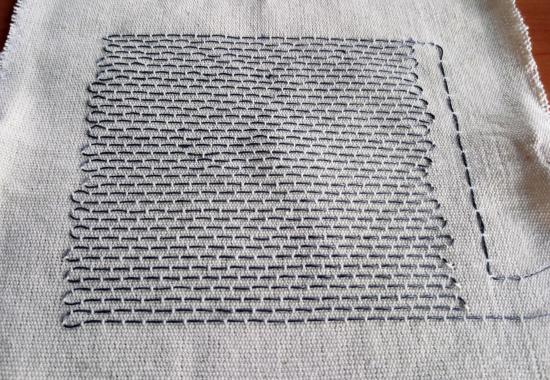
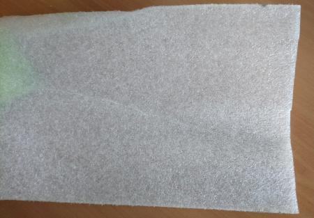
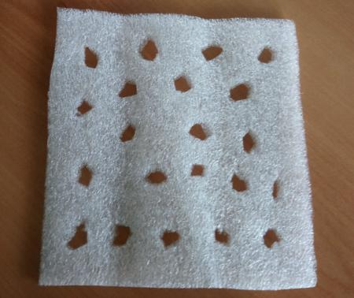
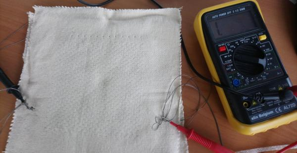
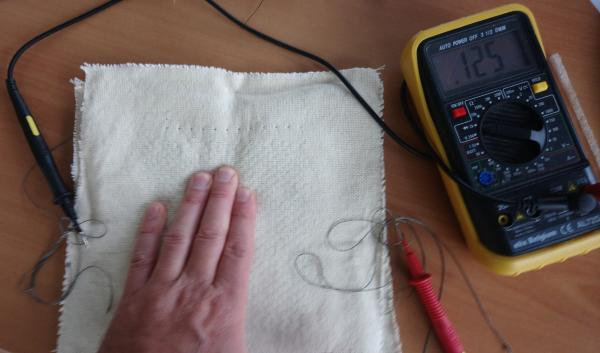

# Level 2: Textile Pushbutton Circuit

## Introduction

In this level, we make a textile pushbutton to use in a light circuit.
This could be used for:

1. Create interaction on clothes by pushing buttons
2. Have a baseball cap which switches LED's on only when on the head
3. Create a chair pillow that lights up when you sit on it

What does make this circuit different?  We use textile elements to create the push button and electronical components 
adapted for use on textiles.

## BOM (Bill of Materials)

1. Base textile: a T-shirt, a baseball cap, a fabric. Select the textile you want to add lights to!
    1. Fruit of the Loom t-shirts can be bought for less than 2 Eur/T-shirt. Google it!
    2. Baseball caps can be bought for 1 to 2 Eur. 
2. Design: Your final product will be nicer if there is a design on your base textile. You can use other fabrics to make
a design, or use heat transfer vinyl, or textile transfer paper, or embroidery. Make sure it is clear in your design where the LED-Lights
go. A single small coincell battery can power maximally 6 LED's in this set up
3. Conductive thread or conductive fabric. You need a high conductive (low resistance) fabric or yarn. Some options:
    1. Silver coated fabric with conductive adhesive on one side. We only require a small band like the one from [Mission Control Lab](https://missioncontrollab.com/collections/technologist-and-teacher-supply/products/space-tape)
    2. Conductive fabric which needs to be sewed on your base fabric, eg from [adafruit](https://www.adafruit.com/product/1168)
    3. Stainless steel yarn. The cheapest option. There are many resellers of [adafruit Stainless Thin Conductive Thread](https://www.adafruit.com/product/640), for example [Mouser](https://www.mouser.be/ProductDetail/Adafruit/603?qs=sGAEpiMZZMu%252BmKbOcEVhFQfi8wYXkauJFoZL2xpCq%252BVRONBlSbRF3w%3D%3D)
    4. Silver plated yarn. The highest conductivity. Madeira has a range for embroidery that can be bought from every Madeira reseller: [HC 12 150m SMALL CONE](https://shop.madeira.co.uk/hc-12-150m-sample-(high-conductive)_hc12-smp-xxx-xxx.htm)
4. LED lights. You can use standard ones (cheapest) or specially designed (brighter)
    1. Sewable LED lights with integrated resistor, eg from [Kitronik](https://www.kitronik.co.uk/2746-electro-fashion-sewable-5mm-led-holder-pack-of-10.html)
    2. Standard 3V LED packs, eg from [amazon.de](https://www.amazon.de/APTWONZ-2-poligen-Diffuse-Leuchtdioden-Elektronikkomponenten/dp/B06X3VT6TD)
    3. In combination with above standard LED's, you can 3D print a small holder making it easier to attach the LED to textile. Use [this design](https://www.thingiverse.com/thing:265121).
5. Battery holder for coincell battery. We use a 3.3V coincell. You can buy a normal coincell holder, one specifically designed for textile, or 3D print one.
    1. Sewable battery holder without switch, eg from [Kitronik](https://www.kitronik.co.uk/2701-sewable-coin-cell-holder.html)
    2. 3V battery holder standard with holes that allow sewing, eg [BA2032SM](https://www.enrgtech.co.uk/buy/product/ET14129119/BA2032SM)
    4. CR2032 battery. This is the standard coincell battery you can buy everywhere for 1 to 2 Eur or less.
    5. 3D printed 3V battery holder, eg [this design](https://www.thingiverse.com/thing:265116) or [this one](https://www.thingiverse.com/thing:250503)
6. Thick fabric or foam for the pushbutton. This is needed to create the fabric pushbutton. 
    1. 2 to 3 mm felt. These can be bought in hobbystores or recycled.
    2. A simple way to reduce work is to use **corn cushions**. These already have the shape we will need. Buy in the local pharmacy or in
    the grossery store. Or online, eg [amazon](https://www.amazon.co.uk/Profoot-Corn-Cushions-Pack-24/dp/B013AVRWVK/ref=sr_1_8?crid=PSW71S7R8NL9&keywords=corn+plasters+for+feet&qid=1565687361&s=gateway&sprefix=corn+plaster%2Caps%2C151&sr=8-8)
    3. A foam that can easily be cut and is compressible, eg recylce it from packaging.

## Demonstrator 03 Construction

We make a demonstrator showing how to make a push button circuit in a way that the fabric is still maximally flexible. 

### Step 01 - Design your product: What will you make?

Our demonstrator will form a side of a textile cube people can interact with: when they push at a certain location, lights go on.

Start with collecting your materials. In our case we have selected 6 dedicated LEDs for use in textiles, conductive fabric instead of condutive yarn,
a corn cushion and a battery holder, together with felt as base material.

### Step 02 - Construction 

#### Principle
A circuit with a battery, pushbutton and 6 LED's has the following diagram:

We will create this circuit in a sandwich textile structure. This means we have a backing layer, the circuit placed on top of this, and then a top layer. As the chosen textile is partially transparent to light, we will make **no holes** in the top layer. This protects the electronics from the user. Schematically this is:

#### Principle of the Push Button

The layering also helps in constructing the textile push button, as seen in the figure above. We use two conductive parts  separated by a compressible layer (our foam of felt) with a hole. The conductive part can be conductive fabric or yarn. By compression the top and bottom parts can connect, closing our circuit.

Any foam can be used. We use in this demonstrator a corn cushions as these already have the form and structure we require, without extra cutting needed.

#### Placing the components

We use the adhesive conductive fabric to fix the components to the back layer. If you use conductive yarn or non-adhesive conductive fabric to make the connections, you need to sew them in place.

Make a circuit connecting all + of the LED's together, and all - together, as follows:

#### Creating the push button
Now create the push button according to the principle given above. Place the corn cushion over the conductive fabric. On the underside of the top layer you place conductive fabric so that after sewing it is just above the hole in the corn cushion.

Next, link the conductive fabric on the underside of the top layer to the circuit layer on the back layer to close the circuit.

### Step 03 - Finishing up

Place a battery in the holder and test if the button and LED's work.

Now, create the front layer, and sew it over the back layer. Make a cut in the back layer to allow replacing the battery when needed.

 

## Demonstrator 04 Construction

Here we show the same principle of a push button, but using conductive yarn. 

### Step 01 - creating a large conductive fabric.

It is possible to use conductive yarn on production machines to sew, knit, weave or embroider. As an example, we used conductive wire to create a woven structure. In this the warp yarns are cotton, and the weft yarns are cotton, except that every 4 mm conductive stainless steel yarn is placed. The result is:

Making two of these, we have a back layer and a top layer, but now the circuit is integrated into the fabric instead of placed on top of the back layer. These constuctions are ideal for heating fabric or for integration in for example upholstery.

### Step 02 - Turn it into a push button.

To turn our woven conductive fabric into a push button, we require a foam in the middle. We used packaging of an electrical appliance:

Cut this in the required size, then make holes where you want a push action turned into an input for your electronical circuit. In our case, we want any large push (hand) in the zone to lead to a push, so we add holes everywhere. Careful, the holes should not be too small or a push will not be registered, and not too large, or the fabric will bend in the holes and make contact also if nobody pushes. Our resulting foam is:

Now create the sandwich structure, using the back material, the foam and the top material. As the conductive yarns in our woven structure are in one direction (the weft of the fabric), make sure the yarns of the top and bottom layer are perpendicular. So for example, place them horizontally in the back material, and vertically in the top material.

### Step 03 - Test and finalize.

Test the push button before sewing everything together. Use a multimeter to measure the resistance. When no push is done, the circuit is open, which a multimeter displays as 1.

 

Push on the fabric. The resistance should drop below 180 Ohm, which for a 3V battery means a LED can be activated on push.

To finalize the circuit, as in [Demonstrator 03](construction.md#demonstrator-03-construction), use a battery and LED to react to the push action. In our case we connect this push button to the same battery and LED as in [Demonstrator 03](construction.md#demonstrator-03-construction).
