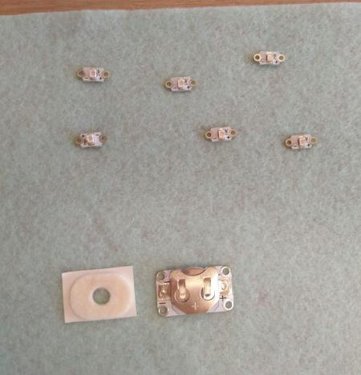
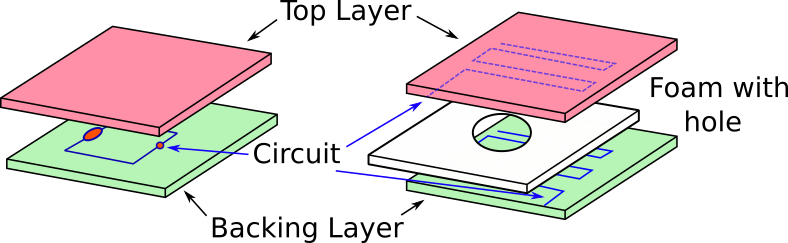
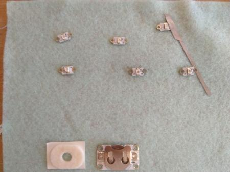
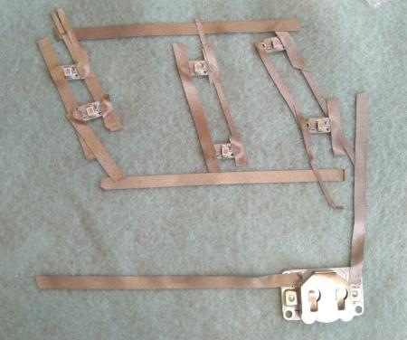
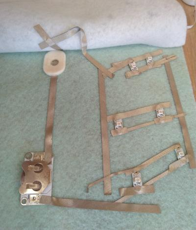
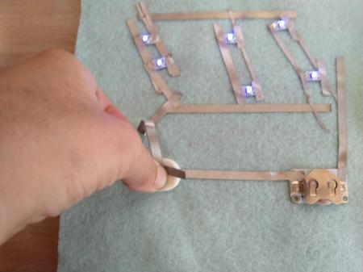
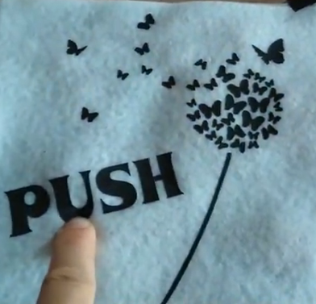
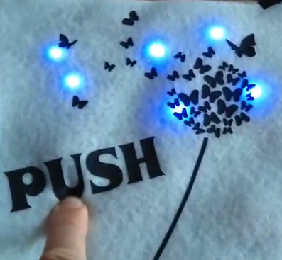

# Level 2: Textile Pushbutton Circuit

## Introduction

In this level, we create a textile pushbutton which we use in a light circuit.
This could be used for:

1. Create interaction on clothes by pushing button
2. Have a baseball cap which switches LED on only when on the head
3. Create a chair pillow that lights up when you sit on it

What makes this circuit different is that we use textile elements to create the push button and electronical components 
adapted for use on textiles.

## BOM (Bill of Materials)

1. Base textile: a T-shirt, a baseball cap, a fabric. Select the textile you want to add lights to!
    1. Fruit of the Loom t-shirts can be bought for less than 2 Eur/T-shirt. Google it!
    2. Baseball caps can be bought for 1 to 2 Eur. 
2. Design: Your final product will be nicer if there is a design on your base textile. You can use other fabrics to make
a design, or use transfer vinyl paper, or transfer paper, or embroidery. Make sure in your design it is clear where the LED-Lights
go. A single small coincell battery can power maximally 6 LED in this set up
3. Conductive thread or conductive fabric. You need a high conductive (low resistance) fabric or yarn. Some options:
    1. Silver coated fabric with conductive adhesive on one side. We only require a small band like from [Mission Control Lab](https://missioncontrollab.com/collections/technologist-and-teacher-supply/products/space-tape)
    2. Conductive fabric which needs to be sewed on your base fabric, eg from [adafruit](https://www.adafruit.com/product/1168)
    3. Stainless steel yarn. The cheapest option. Many resellers of [adafruit Stainless Thin Conductive Thread](https://www.adafruit.com/product/640), for example [Mouser](https://www.mouser.be/ProductDetail/Adafruit/603?qs=sGAEpiMZZMu%252BmKbOcEVhFQfi8wYXkauJFoZL2xpCq%252BVRONBlSbRF3w%3D%3D)
    4. Silver plated yarn. The highest conductivity. Madeira has a range for embroidery that can be bought from every Madeira reseller: [HC 12 150m SMALL CONE](https://shop.madeira.co.uk/hc-12-150m-sample-(high-conductive)_hc12-smp-xxx-xxx.htm)
4. LED lights. You can use standard ones (cheapest) or specially designed (brighter)
    1. Sewable LED lights with integrated resistor, eg from [Kitronik](https://www.kitronik.co.uk/2746-electro-fashion-sewable-5mm-led-holder-pack-of-10.html)
    2. Standard 3V LED packs, eg from [amazon.de](https://www.amazon.de/APTWONZ-2-poligen-Diffuse-Leuchtdioden-Elektronikkomponenten/dp/B06X3VT6TD)
    3. In combination with above standard LED, you can 3D print a small holder making it more easy to attach the LED to textile. Use [this design](https://www.thingiverse.com/thing:265121) then
5. Battery holder for coincell battery. We use a 3.3V coincell. You can buy a normal coincell holder, one specifically designed for textile, or 3D print one.
    1. Sewable battery holder without switch, eg from [Kitronik](https://www.kitronik.co.uk/2701-sewable-coin-cell-holder.html)
    2. 3V battery holder standard with holes that allow sewing, eg [BA2032SM](https://www.enrgtech.co.uk/buy/product/ET14129119/BA2032SM)
    4. CR2032 battery. This is the standard coincell battery you can buy everywhere for 1 to 2 Eur.
    5. 3D print 3V battery holder, eg [this design](https://www.thingiverse.com/thing:265116) or [this one](https://www.thingiverse.com/thing:250503)
6. Thick fabric or foam for the pushbutton. This is needed to create the fabric pushbutton. 
    1. 2 to 3 mm felt. These can be bought in hobbystores or recycled.
    2. A simple way to reduce work is to use **corn cushions**. These already have the shape we will need. Buy in the local pharmacy or in
    the supermaket. Or online, eg [amazon](https://www.amazon.co.uk/Profoot-Corn-Cushions-Pack-24/dp/B013AVRWVK/ref=sr_1_8?crid=PSW71S7R8NL9&keywords=corn+plasters+for+feet&qid=1565687361&s=gateway&sprefix=corn+plaster%2Caps%2C151&sr=8-8)
    3. A foam that can easily be cut and is compressible, eg recylce it from packaging

## Demonstrator 03 Construction

We will make a demonstrator showing how to make a push button circuit in a way that the fabric is still maximally flexible. 

### Step 01 - Design your product: What will you make?

Our demonstrator will form a side of a textile cube people can interact with: when they push at a certain location, lights go on.

Start with collecting your materials. In our case we have selected 6 dedicated LEDs for use in textiles, conductive fabric instead of condutive yarn,
a corn cushion and a battery holder, together with felt as the fabric material.

### Step 02 - Construction 

#### Principle
A circuit with a battery, pushbutton and 6 LED has following circuit diagram:

We will create this circuit in a sandwich textile structure. This means we have a backing layer, the circuit placed on top of this, and then a top layer. As textile is partially transparent to light, we will make **no holes** in the top layer. This protects the electronics from the user. Schematically this is:

#### Principle of the Push Button

This layering also helps in constructing the textile push button, as seen in the figure above. We use a two conductive parts kept separated by a compressible layer (our foam of felt) with a hole. The conductive part can be conductive fabric or yarn. By compression the top and bottom parts can connect, closing our circuit.

Any foam can be used. We use in this demonstrator a corn cushions as these already have the form and structure we require, without extra cutting needed.

#### Placing the components

We use the adhesive conductive fabric to fix the components to the backing layer. If you use conductive yarn or non-adhesive conductive fabric to make the connections, you need to sew them in place instead.

Make a circuit connecting all + of the LED together, and all - together, as follows:

#### Creating the push button
Now create the push button according to the principle given above. Place the corn cushion over the conductive fabric. On the underside of the top layer you place conductive fabric so that after sewing it is just above the hole in the corn cushion.

Next, link the conductive fabric on the underside of the top layer to the circuit layer on the backing layer so as to close the circuit.

### Step 03 - Finishing up

Place a battery in the holder and test if the button and LED work.

Now, create the front layer, and sew it over the backing layer. Make a cut in the backing layer to allow replacing the battery when needed.

 

