# Level 3: Pressure Sensitive Textile

## Introduction

In this level, we use pressure sensitive textile to intereact with a program running on a microprocessor.
This could be used for:

1. Create an interactive game where pushes of different strength must be used
2. Detect how long somebody is sitting on a chair to give feedback to be active
3. Create an insole that detects your step pattern

What makes this circuit different is that we use textile elements and electronical components adapted for use on textiles.

## BOM (Bill of Materials)

1. Base textile: a T-shirt, a baseball cap, a fabric. Select the textile you want to add lights to!
    1. Fruit of the Loom t-shirts can be bought for less than 2 Eur/T-shirt. Google it!
    2. Baseball caps can be bought for 1 to 2 Eur. 
    3. Felt is a great thicker textile product to integrate electronics in. Search for polyester A4 felt sheet in your local hobby shop, they cost between 1 to 2 Eur.
2. Design: Your final product will be nicer if there is a design on your base textile. You can use other fabrics to make
a design, or use heat transfer vinyl, or textile transfer paper, or embroidery. Make sure in your design it is clear where the LED-lightsgo. 
3. Conductive thread or conductive fabric. You need a high conductive (low resistance) fabric or yarn. Some options:
    1. Silver coated fabric with conductive adhesive on one side. We only require a small band like the one from [Mission Control Lab](https://missioncontrollab.com/collections/technologist-and-teacher-supply/products/space-tape)
    2. Conductive fabricto sew on your base fabric, eg from [adafruit](https://www.adafruit.com/product/1168)
    3. Stainless steel yarn. The cheapest option. There are many resellers of [adafruit Stainless Thin Conductive Thread](https://www.adafruit.com/product/640), for example [Mouser](https://www.mouser.be/ProductDetail/Adafruit/603?qs=sGAEpiMZZMu%252BmKbOcEVhFQfi8wYXkauJFoZL2xpCq%252BVRONBlSbRF3w%3D%3D)
    4. Silver plated yarn. The highest conductivity. Madeira has a range for embroidery that can be bought from every Madeira reseller: [HC 12 150m SMALL CONE](https://shop.madeira.co.uk/hc-12-150m-sample-(high-conductive)_hc12-smp-xxx-xxx.htm)
4. LED lights. You can use standard ones (cheapest) or specially designed (brighter) or fully controllable ones
    1. Sewable LED lights with integrated resistor, eg from [Kitronik](https://www.kitronik.co.uk/2746-electro-fashion-sewable-5mm-led-holder-pack-of-10.html)
    2. Standard 3V LED packs, eg from [amazon.de](https://www.amazon.de/APTWONZ-2-poligen-Diffuse-Leuchtdioden-Elektronikkomponenten/dp/B06X3VT6TD)
    3. In combination with the above standard LED's, you can 3D print a small holder making it more easy to sew the LED. Use [this design](https://www.thingiverse.com/thing:265121).
    4. Neopixel LED lights. For schools buy for example [100 Neopixel pack](https://www.amazon.de/gp/product/B07B7GVFRG/ref=ppx_yo_dt_b_search_asin_title?ie=UTF8&psc=1) which means 0.3 Eur per pixel.
5. Power source. You will use a microprocessor, so higher energy density needed. Simplest solution is to use a power bank to give you 5V of current.
6. Pressure sensitive fabric 
    1. You can make your own, but this requires some work. See the Skills4Smartex course for a howto.
    2. EeonTex Pressure Sensing Fabric, from [Eeonyx](https://eeonyx.com/)
    3. Velostat/Linqstat conductive sheet, eg from [Adafruit](https://www.adafruit.com/product/1361). Not really a fabric, but easy to integrate in fabric. The black plastic to protect electrical components in shipping could behave like velostat and might be an alternative.
7. WeMos D1 mini micro-processor. You can buy them for [4Eur or cheaper](https://www.amazon.de/gp/product/B076F81VZT/ref=ppx_yo_dt_b_search_asin_title?ie=UTF8&psc=1)
    
## Demonstrator 05 Construction

We will make a demonstrator that reads in pressure applied to a fabric, and react to it by showing a light scale.

### Step 01 - Design your product: What will you make?

We want to make a textile input pad that can be squeezed/pressed, the size of a PC mice. 

### Step 02 - Construction of the pressure pad

Start with collecting your fabrics, and cut them in the size you want. The backing and top material:

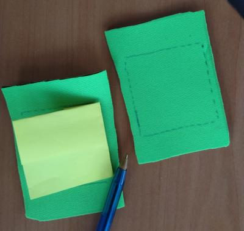

and the pressure sensitive fabric:

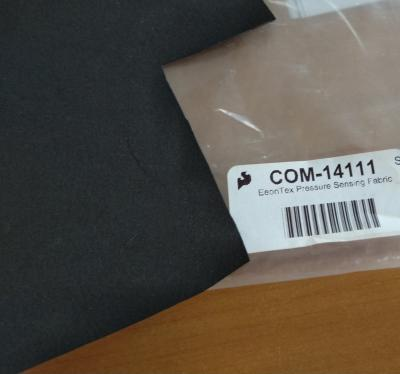

With the conductive yarn, make a pattern on the backing material that will form the electrode in contact with the pressure sensitive fabric

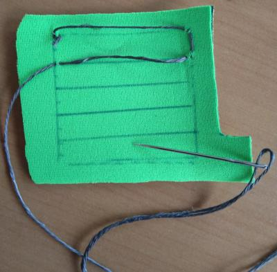 

Add a conductive snap button where the pressure pad will connect to your connector. 

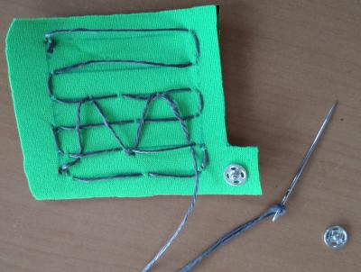

Create a good connection with the snap button 

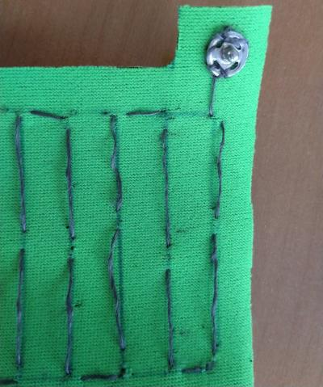

Repeat this step with the top fabric, in such a way that when the electrodes are facing each other the snap button connectors are in different positions so they cannot create a short circuit

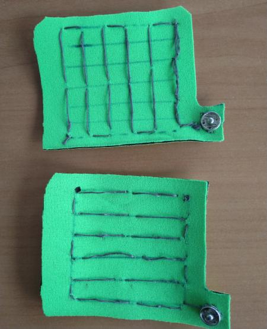

Now add the pressure sensitive material in the middle

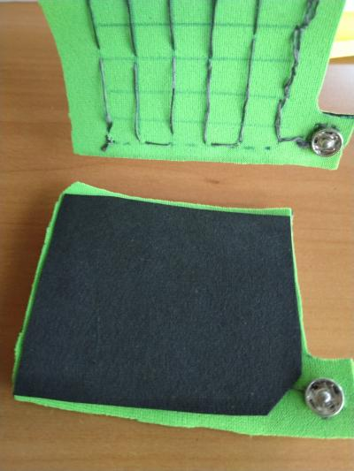

If there is a danger of short circuit between the electrodes, add some cover fabric as in the image below. Non conductive fabric and yarn are used for this. 

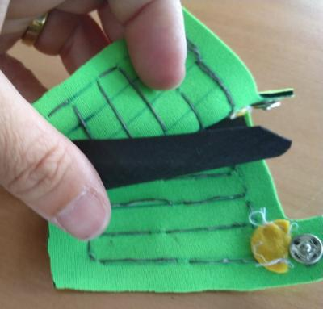

Once satisfied, sew everything together to obtain a thin pad.

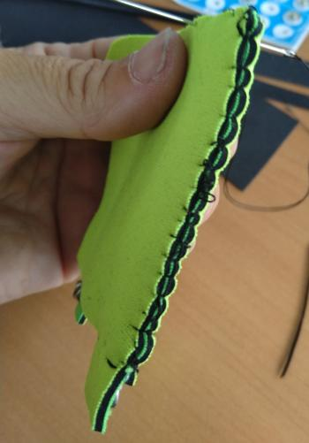

Test the pressure pad to see that different pressures give different values of the resistivity. Use a multimeter for this. In our case, we measure on no pressure 15.5 kOhm

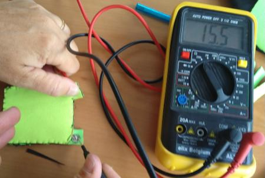

When applying pressure this drops, as in the following figure where the pressure is 1.8 kOhm

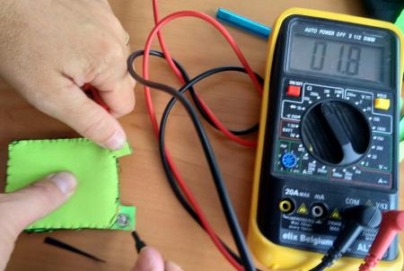

The pressure pad can already be used now, but we want a more robust larger pad for our application. Adding extra foam will spread out the pressure better causing less variation. It will also make the pad larger which is more suitable for smaller children, allowing for a squeezing action. We add foam at bottom and top, and close everything in a felt cover

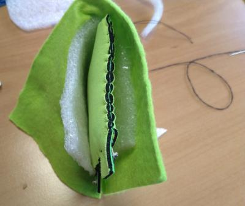

The final pressure pad seen from top and bottom is:

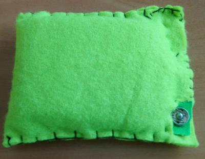 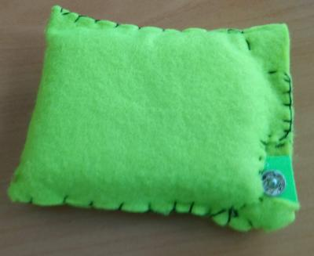

### Step 3 - Reading in the pressure data

A variable pressure data is only usefull if we read this in with a microprocessor, and react to the pressure level. One could add a screen to show pressure data, or create a game that reacts to the amount of pressure. To show the principle, we will read in the data, and react with light depending on the pressure level, going from green light on no pressure, blue on medium, and red on high pressure.

We still need to add for this the following parts:

1. A connector from our pressure pad to the shirt/fabric/surface where the reaction is
2. A battery. As a microprocessor consumes more power, AAA batteries or a powerbank can be used
3. A microprocessor to read in the sensor and react to it. 
4. An RGB LED that can show multiple colors. 

We select following components:

1. Ingegno 3 wire elastic fabric 

    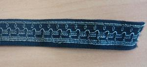

2. For power we select a powerbank, using a micro usb cable to deliver the power to the board
3. Neopixel LED
4. WeMos D1 Mini board.

#### Creating the connector

The connector is explained here

#### Creating the actuator: neopixel LED on fabric

Adding neopixel to a fabric

#### Adding the WeMos and connections to sensor and actuator

Connecting sensor and neopixel to the WeMos and placing the WeMos on the fabric

### Step 4 - Testing and Finishing touches

Pictures of the final result
