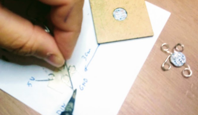

# Level 3: Pressure Sensitive Textile

## Introduction

In this level, we use pressure sensitive textile to intereact with a program running on a microprocessor.
This could be used for:

1. Create an interactive game where pushes of different strength must be used
2. Detect how long somebody is sitting on a chair to give feedback to be active
3. Create an insole that detects your step pattern

What makes this circuit different is that we use textile elements and electronical components adapted for use on textiles.

## BOM (Bill of Materials)

1. Base textile: a T-shirt, a baseball cap, a fabric. Select the textile you want to add lights to!
    1. Fruit of the Loom t-shirts can be bought for less than 2 Eur/T-shirt. Google it!
    2. Baseball caps can be bought for 1 to 2 Eur. 
    3. Felt is a great thicker textile product to integrate electronics in. Search for polyester A4 felt sheet in your local hobby shop, they cost between 1 to 2 Eur.
2. Design: Your final product will be nicer if there is a design on your base textile. You can use other fabrics to make
a design, or use heat transfer vinyl, or textile transfer paper, or embroidery. Make sure in your design it is clear where the LED-lightsgo. 
3. Conductive thread or conductive fabric. You need a high conductive (low resistance) fabric or yarn. Some options:
    1. Silver coated fabric with conductive adhesive on one side. We only require a small band like the one from [Mission Control Lab](https://missioncontrollab.com/collections/technologist-and-teacher-supply/products/space-tape)
    2. Conductive fabricto sew on your base fabric, eg from [adafruit](https://www.adafruit.com/product/1168)
    3. Stainless steel yarn. The cheapest option. There are many resellers of [adafruit Stainless Thin Conductive Thread](https://www.adafruit.com/product/640), for example [Mouser](https://www.mouser.be/ProductDetail/Adafruit/603?qs=sGAEpiMZZMu%252BmKbOcEVhFQfi8wYXkauJFoZL2xpCq%252BVRONBlSbRF3w%3D%3D)
    4. Silver plated yarn. The highest conductivity. Madeira has a range for embroidery that can be bought from every Madeira reseller: [HC 12 150m SMALL CONE](https://shop.madeira.co.uk/hc-12-150m-sample-(high-conductive)_hc12-smp-xxx-xxx.htm)
4. LED lights. You can use standard ones (cheapest) or specially designed (brighter) or fully controllable ones
    1. Sewable LED lights with integrated resistor, eg from [Kitronik](https://www.kitronik.co.uk/2746-electro-fashion-sewable-5mm-led-holder-pack-of-10.html)
    2. Standard 3V LED packs, eg from [amazon.de](https://www.amazon.de/APTWONZ-2-poligen-Diffuse-Leuchtdioden-Elektronikkomponenten/dp/B06X3VT6TD)
    3. In combination with the above standard LED's, you can 3D print a small holder making it more easy to sew the LED. Use [this design](https://www.thingiverse.com/thing:265121).
    4. Neopixel LED lights. For schools buy for example [100 Neopixel pack](https://www.amazon.de/gp/product/B07B7GVFRG/ref=ppx_yo_dt_b_search_asin_title?ie=UTF8&psc=1) which means 0.3 Eur per pixel.
5. Power source. You will use a microprocessor, so higher energy density needed. Simplest solution is to use a power bank to give you 5V of current.
6. Pressure sensitive fabric 
    1. You can make your own, but this requires some work. See the Skills4Smartex course for a howto.
    2. EeonTex Pressure Sensing Fabric, from [Eeonyx](https://eeonyx.com/)
    3. Velostat/Linqstat conductive sheet, eg from [Adafruit](https://www.adafruit.com/product/1361). Not really a fabric, but easy to integrate in fabric. The black plastic to protect electrical components in shipping could behave like velostat and might be an alternative.
7. WeMos D1 mini micro-processor. You can buy them for [4Eur or cheaper](https://www.amazon.de/gp/product/B076F81VZT/ref=ppx_yo_dt_b_search_asin_title?ie=UTF8&psc=1)
    
## Demonstrator 05 Construction

We will make a demonstrator that reads in pressure applied to a fabric, and react to it by showing a light scale.

### Step 01 - Design your product: What will you make?

We want to make a textile input pad that can be squeezed/pressed, the size of a PC mice. 

### Step 02 - Construction of the pressure pad

Start with collecting your fabrics, and cut them in the size you want. The backing and top material:

and the pressure sensitive fabric:

With the conductive yarn, make a pattern on the backing material that will form the electrode in contact with the pressure sensitive fabric

 

Add a conductive snap button where the pressure pad will connect to your connector. 

Create a good connection with the snap button 

Repeat this step with the top fabric, in such a way that when the electrodes are facing each other the snap button connectors are in different positions so they cannot create a short circuit

Now add the pressure sensitive material in the middle

If there is a danger of short circuit between the electrodes, add some cover fabric as in the image below. Non conductive fabric and yarn are used for this. 

Once satisfied, sew everything together to obtain a thin pad.

Test the pressure pad to see that different pressures give different values of the resistivity. Use a multimeter for this. In our case, we measure on no pressure 15.5 kOhm

When applying pressure this drops, as in the following figure where the pressure is 1.8 kOhm

The pressure pad can already be used now, but we want a more robust larger pad for our application. Adding extra foam will spread out the pressure better causing less variation. It will also make the pad larger which is more suitable for smaller children, allowing for a squeezing action. We add foam at bottom and top, and close everything in a felt cover

The final pressure pad seen from top and bottom is:

 

### Step 3 - Reading in the pressure data

A variable pressure data is only usefull if we read this in with a microprocessor, and react to the pressure level. One could add a screen to show pressure data, or create a game that reacts to the amount of pressure. To show the principle, we will read in the data, and react with light depending on the pressure level, going from green light on no pressure, blue on medium, and red on high pressure.

We still need to add for this the following parts:

1. A connector from our pressure pad to the shirt/fabric/surface where the reaction is
2. A battery. As a microprocessor consumes more power, AAA batteries or a powerbank can be used
3. A microprocessor to read in the sensor and react to it. 
4. An RGB LED that can show multiple colors. 

We select following components:

1. Ingegno 3 wire elastic fabric 

    

2. For power we select a powerbank, using a micro usb cable to deliver the power to the board
3. Neopixel LED
4. WeMos D1 Mini board.

#### Creating the connector
Now we create the textile connector to connect our pressure pad with our electronics. Take the Ingegno 3 wire elastic fabric, and cut 5cm lengthwise, so as to have a left wire and a right wire. Sew reinforcement under it.

Then connect the other side of the snap buttons to the connector. Use conductive thread to do this and make sure there is a good contact between the snap button and the wire on this side of the connector

One side goes to the first button on the pressure pad, the other side to the other button. 

#### Adding the electronics and the connections to sensor and actuator

The electronics are the WeMos and the neopixels, which are rigid components. We need to create a method to connect them to our fabric in a strong way. For this, we create loops. Cut a piece of single core filament wire of 3cm, strip away the plastic, and use a round plier to create a loop and connector. 

A neopixel will need 4 loops, one for 5V in, one for GND, one for signal Din, and one for the out signal Dout. The placement will be like:

For simplicity, we create a lasercut hole in 3mm mdf to place the neopixel in, so as to simplify soldering the loops. Put tin on the end of the loops first, use tape to avoid movement of the loops while soldering.

 

You should end up with your neopixel in a format that allows sewing

 
Different configurations are possible, all are good.

Also the wemos must be adapted in such a way as to allow integration with fabric. We created a lasercut base to strengthen the wemos and the connections, and soldered loops to pins that are needed. The svg file you can use to lasercut is:

For the sensing circuit to the presssure pad we use D7 and D5, where if D7 is HIGH (=3.3V) and D5 is LOW (=GND or 0V), the sensor is used. Between the sensor and D5 the fixed sensing resistor is placed, it's value should be computed based on the resistance of the variable sensor resistance, see the skills4smartex course. Between the variable resistor and the fixed resistor, we connect to A0 to read out the pressure value of the variable resistor. The setup is as follows.

In the above figure, the 5V still needs to be soldered. 
Now place the WeMos on the fabric so as to integrate it with the fabric. To allow the base fabric to be washed, we attach the WeMos to a secondary fabric we will be able to remove from the base fabric. Snap buttons are again used for this. So use conductive wires to connect from the loops of the WeMos to the location where you place the snap buttons.

As you can see, the base plate has holes which are used to connect the WeMos to the secondary fabric more securely. Do this for all the pins needed

Now determine the correct location of the corresponding snap buttons on the base fabric, and sew them in place.

#### Creating the actuator: neopixel LED on fabric

The actuation is done with the neopixels. Decide where they should be placed on the base fabric. Now draw the sewing lines in such a way that they __do not touch__. The great thing about working with felt is that due to it's thickness we can place a yarn on the inside of the felt also to make sure there is no contact. Also be carefull not to run wires that could touch the WeMos, as that can create short circuit also! We only need GND, 5V and pin D3 in this application, so we use following traces:

Carefully sew all these traces with conductive yarn.

### Step 4 - Finishing touches

For the D5 and D7 pins that connect to the sensor, two snap buttons are used at the end of the connector to connect to our base fabric on the visible side of the fabric (so the back side of this the electronics run.

Congratulations, you have finished your prototype. The base fabric can now be attached to a wall, or pillow, or another application that can use the pressure sensor.

You can now upload code to the WeMos to calibrate your sensor (see skills4smartex course), or code that can respond to the pressure input, see below

### Step 5 - Programming

A level 3 smart prototype needs programming of the micro-processor in order to have an acutation based on the sensor input. First you should calibrate your sensor. See the Skills4Smartex course Smart2Stem for an example of this. Here we give an example of possible the final code to run on the WeMos.

Open your browser on [blokkencode.ingegno.be](http://blokkencode.ingegno.be/index_en.html). 

Drag from the `Components` sidebar a board on the canvas, and change it to NodeMCU, which includes the WeMos as type. Set the pins we are using:

So we have `D5` which normally will be set to `LOW`, so our Ground, and `D7` that is set to `HIGH` normally, 3.3V. This connects to the pressure sensor. Then `D3` our input pin for the Neopixels, and `A0` to read out the sensor value, soa Analog Sensor block.

Notice that the Neopixel has 2 pixels. The Neopixels used by us are type RGB+White and 800 KHz. Finally, for debugging purposes we also set up a serial channel at speed 57600 bps.

Now from the Functions sidebar select the Arduino block, and create following setup: 

As you see, 4 variables are created.

For the debugging, from the Functions sidebar, select an effect that runs once every 1000 milliseconds, and that prints out the measured pressure value.

Now, create the actual code that reads in the sensor value and determines based on that what color to show on the Neopixels. One possibility is:

You are finished, copy your code to the Arduino IDE. You need to have the Adafruit Neopixel library installed, so go to `Tools--> Manage Libraries`, search for this library and install it.

Now upload this sketch to your board. In the Arduino IDE select for the Wemos board, following settings:

Connect the usb cable to your WeMos, select the correct port, and upload the code.

## Demonstrator 06: smart shoe

In the same principle a smart shoe insole can be made. 

For this a more robust WeMos holder is needed that can be placed on the side of a shoe. A possible construction is the following svg file:

